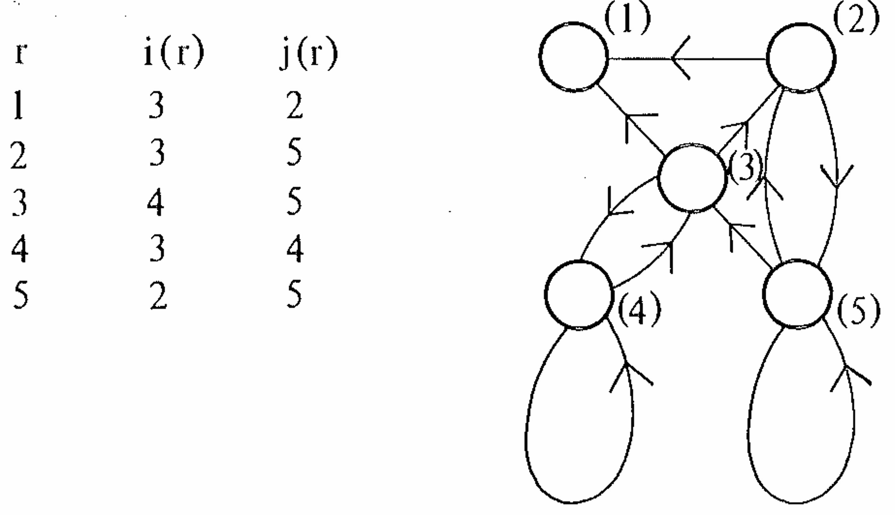
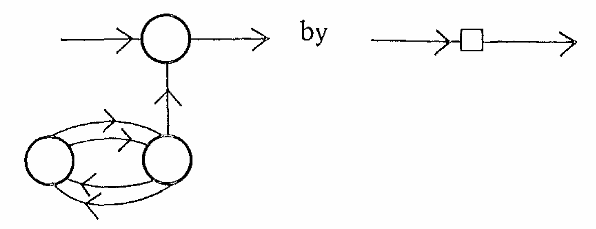

I recently revisited a very old paper by Alan Turing: [*Intelligent Machinery*](https://people.csail.mit.edu/brooks/idocs/IntelligentMachinery.pdf), written in 1948. In this paper, Turing discusses the initial idea of AI: how to model AI, and how to train AI. Even though it is a very old paper and the words are kinds of obscure to me, it is still worth reading the whole paper in detail. In this blog post, I will interprete some interesting ideas in the paper, and hopefully it also inspire broader audience as well.

### A-type Unorganized Machine

We know that Turing Machine is the math model of computers. It is designed with specific purpose: how the machine state transits, what action to take under specific state, how the tape moves, etc. Here Turing proposes another type of machine: unorganized machine. 

This type of machine has several units to describe the state of the machine. Each unit can be 0 or 1. The key is that the units are connected randomly instead of intended for some specific purposes. Let's say, the state of unit $r$ at step $t+1$ depends on the states of other two units $i$ and $j$: $r_{t+1} := 1 - i_t \times j_t$. Here is an example in the original paper:

A possible sequence of state is here:
| unit\time | 0    | 1    | 2    | 3    | 4    | 5    |
| --------- | ---- | ---- | ---- | ---- | ---- | ---- |
| 1         | 1    | 1    | 0    | 0    | 1    | 0    |
| 2         | 1    | 1    | 1    | 0    | 1    | 0    |
| 3         | 0    | 1    | 1    | 1    | 1    | 1    |
| 4         | 0    | 1    | 0    | 1    | 0    | 1    |
| 5         | 1    | 0    | 1    | 0    | 1    | 0    |

We can find that starting from step 3 the machine state changes periodically. This means an unorganized machine will finally behave stably, without external interference.

### B-type Unorganized Machine

Suppose we denote a type of circuit in A-type machine as this:

This time the square in the circuit becomes a "switch" or "condition" that can control the signal passing through. Concretely, it has three modes:
1. interchange the signal between 0 and 1
2. convert the signal to 1
3. switch between mode 1 and 2

Let's denote the below two unit as $A$ and $B$, the upper unit as $C$ and the input signal as $D$.

Mode 1:
| unit\time | 0    | 1    | 2    | 3    |
| --------- | ---- | ---- | ---- | ---- |
| A         | 0    | 0    | 0    | 0    |
| B         | 1    | 1    | 1    | 1    |
| C         | 0    | 1    | 0    | 0    |
| D         | 0    | 1    | 1    | 0    |

Mode 2: 
| unit\time | 0    | 1    | 2    | 3    |
| --------- | ---- | ---- | ---- | ---- |
| A         | 1    | 1    | 1    | 1    |
| B         | 0    | 0    | 0    | 0    |
| C         | 0    | 1    | 1    | 1    |
| D         | 0    | 1    | 1    | 0    |

Mode 3:
| unit\time | 0    | 1    | 2    | 3    | 4    | 5    |
| --------- | ---- | ---- | ---- | ---- | ---- | ---- |
| A         | 0    | 1    | 0    | 1    | 0    | 1    |
| B         | 0    | 1    | 0    | 1    | 0    | 1    |
| C         | 0    | 1    | 1    | 1    | 0    | 1    |
| D         | 0    | 0    | 0    | 1    | 1    | 1    |

The key idea here is, the states of $A$ and $B$ serve as an interface to control the behavior of an unorganized machine! It provides a method to **modify** the machine. Turing summarizes that the way we build AI is to **modify** or **educate** the machine. We find that building this unorganized machine is actually simple. So the question is, how to modify the machine?

### P-type Unorganized Machine

Turing finally proposes P-type unorganized machine. This type of machine is more complicated then the previous two machines. And it works pretty much the same as reinforcement learning nowadays. This machine is incomplete and requires external interference to *organize* it.

First, the machine has *situations* $s=1,2,...,N$. I think it is basically the state of the machine. At each state, the performs either a visible action $A_1,A_2, ..., A_K$ or modify a memory unit $M_1, M_2, ..., M_R$. The next situation is computed either $2s \, mod \, N$ or $(2s+1) \, mod \, N$, depends on *alternatives* 0 or 1. 

*Alternatives* are determined by three factors: a memory unit $M$, a sense stimuli $S$, or the character entry. The machine will maintain a character table, specifying one character entry for each situation. The character entry can be U (*Uncertain*), T (*Tentative*), and D (*Definite*). U means the machine chooses 0 or 1 randomly. T has T0 and T1, meaning choosing 0 or 1. Similarly, D also has D0 and D1. My interpretation of this *character* is something similar to *policy* in RL. This time character determines the next state of the machine. Both the state and character determine the action the machine performs. In the original paper, Turing states that the configuration of this machine can be described with two expresseions: *character-expression* and *situation-expression*. So this character entry serves as a part of the state and a part of the policy.

The distinct feature of P-type machine is that there is a *pleasure-pain system*. It returns *pleasure* or *pain* to machines. It can be intepreted as a "teacher" to give feedback to machine. *pleasure* or *reward* signal turns all T character entries to D, while *pain* signal converts T back to U. Turing also mentions there is a type of "unemotional" feedback, which is called the *sense stimuli*. I do not quite get the meaning of that. Perhaps pleasure and pain is given due to the machine actions while sense stimuli is nothing to do with the machine action. Thus it is something the teacher communicates "unemotionally" to the machine.

Turing also provide an example for this type of unorganized machine. Suppose a P-type machine is described in the table below
| situation | character       | visible action | memory modification |
| --------- | --------------- | -------------- | ------------------- |
| 1         | P (any U, T, D) | A              |                     |
| 2         | P (any U, T, D) | B              | M1=1                |
| 3         | P (any U, T, D) | B              |                     |
| 4         | S1              | A              | M1=0                |
| 5         | M1              | C              |                     |

Then a possible behavior sequence may be this
| step                 | 0    | 1    | 2    | 3    | 4    | 5    | 6    | 7    | 8    | 9    |
| -------------------- | ---- | ---- | ---- | ---- | ---- | ---- | ---- | ---- | ---- | ---- |
| random sequence      | 0    | 1    | 1    | 1    | 1    | 0    | 0    | 0    | 0    | 0    |
| situation            | 3    | 1    | 3    | 1    | 3    | 1    | 3    | 1    | 2    | 4    |
| alternative given by | U    | U    | T0   | T1   | T0   | T1   | T0   | U    | U    | S1   |
| action               | B    | A    | B    | A    | B    | A    | B    | A    | B    | A    |
| pleasure-pain        |      |      |      |      |      |      | Pain |      |      |      |
| S1                   | 1    |      |      |      |      |      |      |      |      |      |

Note that my table is not exactly the same as the table in the original paper. I am not sure whether my understanding is inaccurate or there are some typos in the paper. But anyway, the algorithm itself is not that important as we are not really studying it. Here I only show 10 steps in the table. We can find that from step 2-6 the machine actually behave periodically, similar to a A-type unorganized machine. But at step 6 the teacher send a pain feedback to the machine. Then all T characters fall back to U, and the behavior changes in the following sequence. It shows how external interference modify the machine, or in another word, how interference *educate* the machine.

### Discipline and Initiative

So far we have seen how to build a machine that can be modified via external interference. But Turing states this is still not enough to achieve AI. He describes two necessary components here: discipline and initiative.

Discipline is what we have seen in previous sections: building a machine following strict rules. Initiative is to make decisions based on a few principle. My interpretation is that it is an ability of acting in a more flexible manner. 

Later in the section Turing mentions three different *search*. He believes it requires some sort of initiative. One is *intellectual search*. I feel it is a search algorithm we use to solve math problems like proving a theorem. We search existing rules and laws and compose them into a logic system to prove the theorem. The second one is *genetical search*. This type of search is based on survival value. 

The last and the most interesting one to me is *cultural search*. We humans grow up in an environment, where we communicate and interact with other people. Environments shape our knowledge and behavior. It reminds me about current research in robotics. Many researchers are chasing world model right now. Recently I saw a demo from 1X robotics. They demonstrate how they control robots with a video world model. It can predict objects motion reasonably, at least visually good. But I found the people in the prediction are kinds of static. In reality, people have their own plan. They cannot be treated as objects. This is critical for house-hold robots since in home scenario I cannot imagine a robot never interacts with humans. Thus, the decision-making system needs to consider the behaviors of other agents. They communicate, and make the optimal decision.